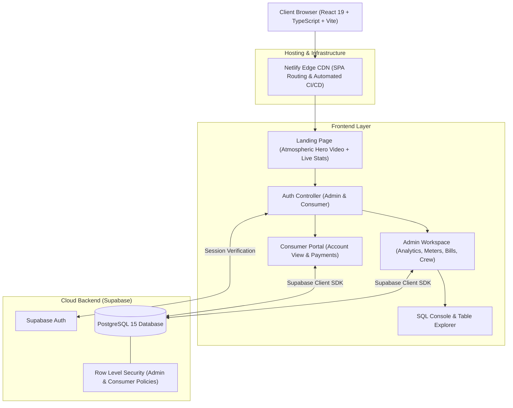
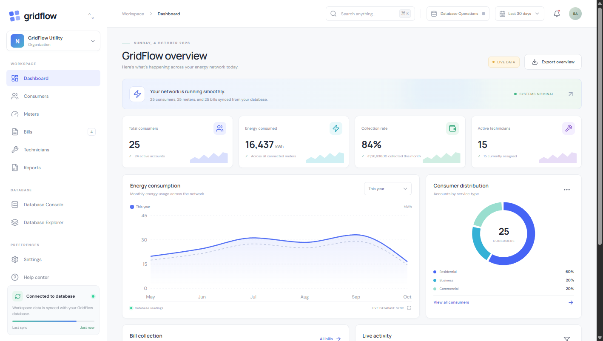
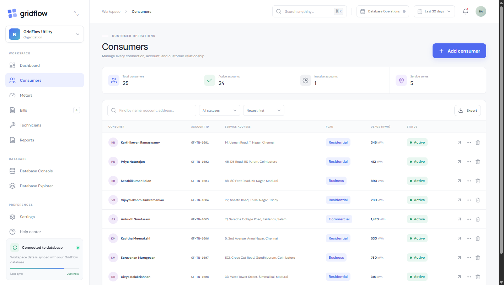
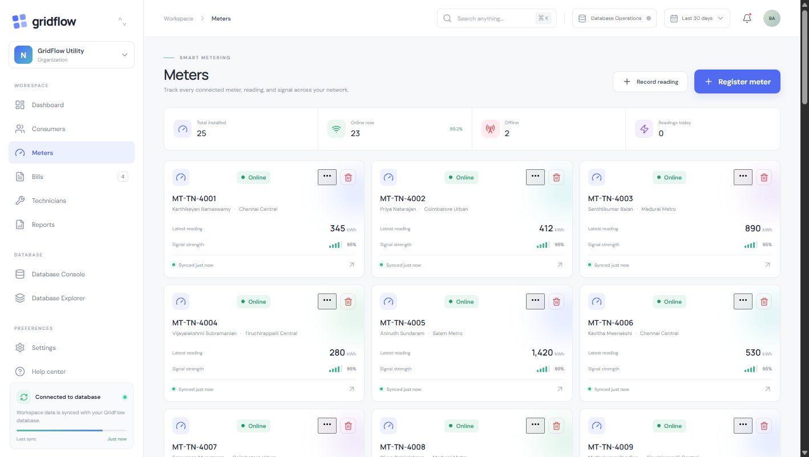
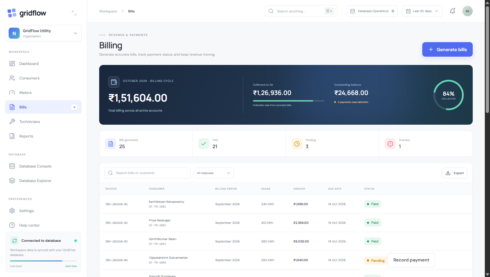
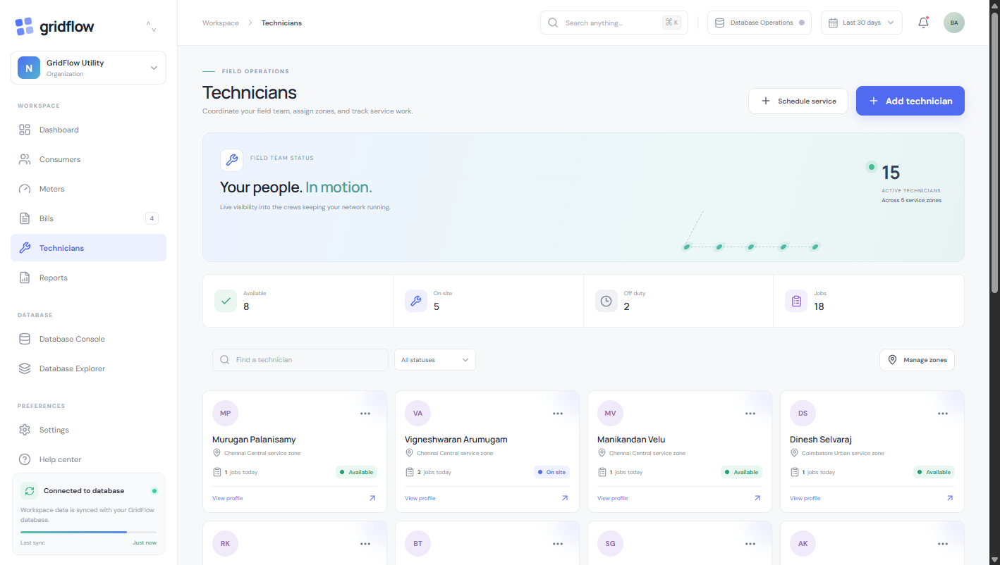
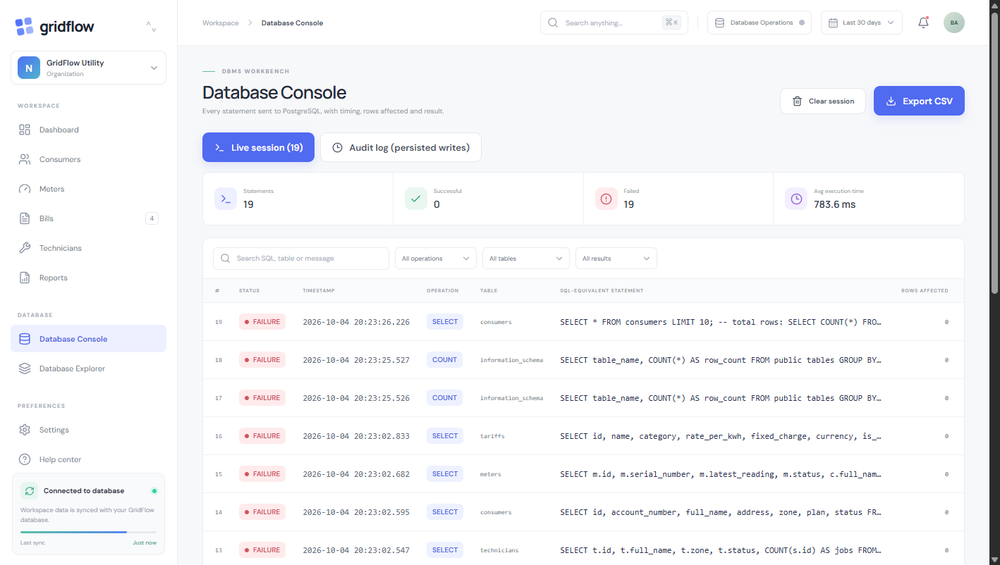
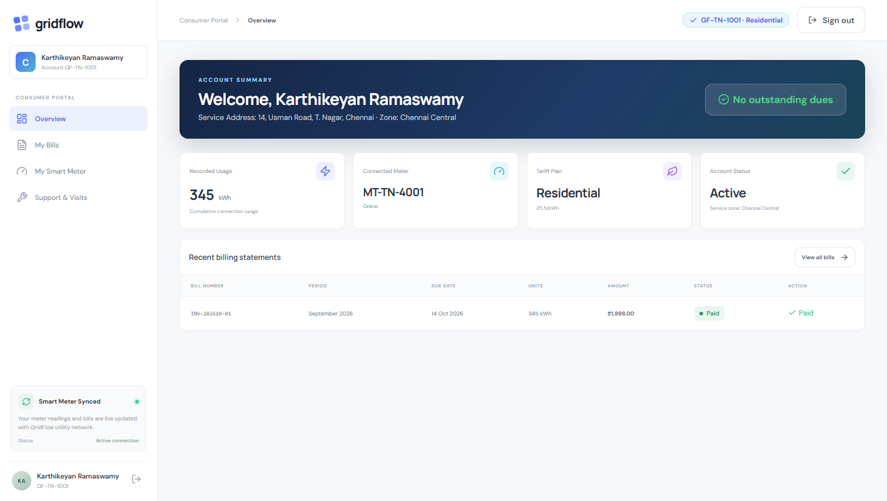

# ⚡️ GridFlow — Next-Gen Smart Energy & Utility Operations Workspace

<div align="center">


**An intelligent, unified cloud workspace for modern electric distribution utilities, smart metering telemetry, automated tariff billing, and field service management.**

[Live Application](#-deployment--hosting) • [Core Features](#-core-features) • [System Architecture](#-system-architecture) • [Database & Schema](#-database-schema--data-model) • [Getting Started](#-getting-started) • [Audit Gallery](#-visual-showcase)

</div>

---

## 📖 Overview

**GridFlow** is an enterprise-grade utility operations platform built to bridge the gap between high-frequency smart meter telemetry, consumer billing, and real-time field operations. 

Engineered with a high-performance **React 19** frontend, **TypeScript**, **Framer Motion**, and backed by **Supabase PostgreSQL**, GridFlow powers end-to-end grid monitoring—from tracking kilowatt-hour (`kWh`) load consumption across regional utility zones to dispatching field maintenance crews and automating tiered tariff revenue collections.

---

## 🌟 Core Features

### 1. 🛡️ Dual-Portal Access System
* **Administrator Control Center**: Secure role-based management environment with real-time grid KPI telemetry, database workbenches, consumer directory management, and invoice audits.
* **Consumer Self-Service Portal**: Frictionless, passwordless portal where energy consumers can view live usage curves, verify connected smart meters, inspect historical bill receipts, and settle utility dues in Indian Rupees (`₹`).

### 2. ⚡️ Smart Meter Telemetry & Infrastructure Management
* Real-time tracking of physical meter hardware across distribution zones (e.g., Chennai, Coimbatore, Madurai, Salem, Tiruchirappalli).
* Granular telemetry metrics:
  * Cumulative usage readings (`kWh`).
  * Live hardware operational status (`ONLINE`, `INACTIVE`, `DISCONNECTED`).
  * Tamper detection indicators and automated anomaly flagging.
* Modal dialogs to register new smart meters, link them directly to consumer accounts, and decommission outdated hardware.

### 3. 💳 Automated Utility Billing Engine
* Multi-tier tariff rating engine supporting:
  * **Domestic (LT-1A)**: Subsidized and tiered residential consumption blocks.
  * **Commercial (LT-2A)**: Demand-based business tariffs.
  * **Industrial (HT-1)**: High-tension industrial load rates.
  * **Agricultural (LT-4)**: Regulated rural power distribution.
* Real-time billing status workflows: `PAID`, `PENDING`, and `OVERDUE`.
* On-the-fly invoice calculations incorporating base energy charges, fixed monthly connection fees, and tax assessments.

### 4. 🛠️ Field Operations & Technician Dispatch
* Real-time maintenance crew registry with zone assignments, active job counts, and availability states (`ACTIVE`, `ON_LEAVE`, `BUSY`).
* Service order lifecycle management: log work orders, schedule on-site inspections for meter defects, and review completion summaries.

### 5. 📊 Executive Analytics & Data Visualization
* Powered by **Recharts**:
  * **Grid Load Curves**: Smooth area charts tracking monthly energy delivery trends.
  * **Category Energy Distribution**: Multi-color bar graphs comparing Domestic vs. Commercial vs. Industrial consumption.
  * **Revenue Health**: Collection rate tracking and outstanding receivable indicators.

### 6. 🗄️ Embedded Database Console & SQL Explorer
* **Database Explorer**: Direct browsing interface for core relational tables with sorting, filtering, and pagination.
* **SQL Workbench**: In-browser SQL execution console allowing administrators to run diagnostic queries directly against the connected Supabase PostgreSQL instance.

---

## 🏗️ System Architecture



---

## 🗃️ Database Schema & Data Model

The backend is structured around a normalized relational model deployed on PostgreSQL:

| Table | Description | Key Attributes |
|---|---|---|
| **`consumers`** | Registered utility account holders | `id`, `account_number`, `full_name`, `email`, `phone`, `zone_id`, `tariff_id` |
| **`meters`** | Physical smart meters installed in premises | `id`, `serial_number`, `consumer_id`, `latest_reading`, `status`, `installed_at` |
| **`meter_readings`**| Time-series periodic reading history | `id`, `meter_id`, `reading_value`, `recorded_at`, `source` |
| **`tariffs`** | Rate definitions per utility category | `id`, `name`, `category`, `rate_per_kwh`, `fixed_charge`, `currency` |
| **`bills`** | Invoices generated per billing cycle | `id`, `consumer_id`, `meter_id`, `units_consumed`, `amount_due`, `status`, `due_date` |
| **`technicians`** | Field utility operations staff | `id`, `full_name`, `phone`, `zone_id`, `status` |
| **`service_records`**| On-site maintenance and support tickets | `id`, `consumer_id`, `meter_id`, `technician_id`, `summary`, `status`, `scheduled_for` |
| **`zones`** | Operational territories and grid sub-stations | `id`, `name`, `code`, `headquarters` |

> Includes a pre-configured seed migration (`supabase/migrations/20261004_seed_tamilnadu_data.sql`) populating realistic distribution infrastructure across 5 major zones (Chennai, Coimbatore, Madurai, Salem, Tiruchirappalli) with 25 consumer premises, connected meters, and field technicians.

---

## 🔐 Authentication & Roles

* **Super Administrator**:
  * **Email**: `balaji.c.m.x64@gmail.com`
  * Authorized for full workspace management, billing dispatch, and database administration.
* **Consumer Portal**:
  * Passwordless verification using registered email and unique **Account ID** (e.g., `CON-TN-001`).

---

## 🛠️ Technology Stack

* **Framework**: [React 19](https://react.dev/)
* **Language**: [TypeScript 5.9](https://www.typescriptlang.org/)
* **Build System**: [Vite 7](https://vitejs.dev/)
* **Styling**: Vanilla CSS3 Custom Design System (Glassmorphism, CSS Variables, Hardware-accelerated transitions)
* **Animations**: [Framer Motion 12](https://www.framer.com/motion/)
* **Charts & Analytics**: [Recharts 2.15](https://recharts.org/)
* **Iconography**: [Lucide React](https://lucide.dev/)
* **Database & BaaS**: [Supabase](https://supabase.com/) (PostgreSQL 15)
* **Continuous Deployment**: [Netlify](https://www.netlify.com/)

---

## 🚀 Getting Started

### Prerequisites
* **Node.js**: `v20.19.0+` or `v22.12.0+`
* **npm**: `v10+`

### 1. Clone & Install Dependencies
```bash
git clone https://github.com/BALAJIx64/GridFlow.git
cd GridFlow
npm install
```

### 2. Configure Environment Variables
Create a `.env.local` file in the project root:
```env
VITE_SUPABASE_URL=https://your-project-id.supabase.co
VITE_SUPABASE_ANON_KEY=your-supabase-anon-key
```

### 3. Run Development Server
```bash
npm run dev
```
Navigate to `http://localhost:5173/` in your browser.

### 4. Build for Production
```bash
npm run build
```
Production assets will be built to the `/dist` directory.

---

## 🌐 Deployment & Hosting

GridFlow is pre-configured for automated continuous deployment on **Netlify** using [`netlify.toml`](netlify.toml):

```toml
[build]
  command = "npm run build"
  publish = "dist"

[[redirects]]
  from = "/*"
  to = "/index.html"
  status = 200
```

1. Connect the GitHub repository in the Netlify Dashboard.
2. In **Site Configuration > Environment Variables**, supply:
   * `VITE_SUPABASE_URL`
   * `VITE_SUPABASE_ANON_KEY`
3. Netlify automatically triggers atomic builds upon every push to the `main` branch.

---

## 📸 Visual Showcase

<div align="center">

### Executive Dashboard & Energy Analytics


### Consumer Directory & Account Management


### Smart Meter Telemetry & Status Monitoring


### Revenue Engine & Utility Billing


### Field Operations & Crew Management


### SQL Console & Diagnostic Workbench


### Consumer Self-Service Portal


</div>

---

## 📄 License

This project is licensed under the **MIT License**.

Developed with ⚡️ for modern, transparent utility infrastructure.
