# ⚡️ GridFlow — Interactive DBMS & Relational Database Learning Platform

<div align="center">


**A hands-on, practical exploration of Relational Database Management Systems (DBMS), SQL querying, and database architecture—using a real-world Smart Energy Grid as the concrete domain case study.**

[Project Motivation](#-project-motivation--learning-objectives) • [Interactive DBMS Tools](#-interactive-dbms-learning-tools) • [Domain Case Study](#-domain-case-study-smart-energy-grid) • [Database Architecture](#-relational-database-schema--data-model) • [System Architecture](#-system-architecture) • [Getting Started](#-getting-started) • [Visual Audit Gallery](#-visual-audit-gallery)

</div>

---

## 🎯 Project Motivation & Learning Objectives

Relational Database Management Systems (DBMS) are often taught through abstract textbook examples and isolated terminal commands. **GridFlow** was specifically built as a **full-stack educational and experimental platform** to bridge the gap between theoretical database concepts and real-world system implementations.

### Key Educational Objectives:
1. **Relational Schema Design & Normalization**: Understanding how to structure entities, 1-to-many and many-to-many relationships, composite foreign keys, cascading constraints, and data integrity.
2. **Transparent Query Execution**: Demystifying what happens under the hood when a user clicks a button in a modern web application—exposing the raw `SELECT`, `JOIN`, `INSERT`, `UPDATE`, and `GROUP BY` statements generated in real time.
3. **Execution Latency & Performance**: Measuring database round-trip times (in milliseconds) and analyzing query complexity and row-return efficiency.
4. **Database Security & Access Control**: Implementing PostgreSQL Row-Level Security (RLS) to enforce data boundaries between public visitors, registered consumers, and system administrators.
5. **Applied Domain Complexity**: Using a rich, real-world case study—an **electricity distribution utility** with smart meter telemetry, multi-tiered tariff calculations, billing lifecycles, and field technician dispatch.

---

## 🔬 Interactive DBMS Learning Tools

GridFlow includes specialized, built-in database inspection tools directly in the workspace so students, developers, and evaluators can observe and experiment with the database in action:

```
┌────────────────────────────────────────────────────────────────────────┐
│                        INTERACTIVE DBMS SUITE                          │
├──────────────────────────┬─────────────────────────┬───────────────────┤
│  ⚡ Live SQL Inspector   │   🗃 Database Explorer   │  💻 SQL Console   │
│  Real-time toasts of SQL │  Visual table browser,  │  In-browser SQL   │
│  queries, latency (ms),  │  schema constraints,    │  workbench for    │
│  and returned row counts │  and live row viewer    │  custom queries   │
└──────────────────────────┴─────────────────────────┴───────────────────┘
```

### 1. ⚡ Live SQL Operations Inspector
* Every user action in the admin dashboard (switching tabs, searching, filtering, adding a meter, generating a bill) generates a real-time **SQL Operation Toast**.
* Each toast displays:
  * **Raw SQL Statement**: Exact syntax with table aliases, `JOIN` conditions, and `ORDER BY` clauses.
  * **Execution Latency**: Time elapsed for the query in milliseconds (e.g., `341.2 ms`).
  * **Result Metric**: Total number of matching rows returned from the database.
* *Note: Intentionally scoped to the administrative workspace to keep the public landing page clean while providing full transparency during operations.*

### 2. 🗃 In-App Database Explorer
* Direct visual inspector for all core relational tables in the PostgreSQL database (`consumers`, `meters`, `meter_readings`, `tariffs`, `bills`, `technicians`, `service_records`, `zones`).
* Allows learners to:
  * Inspect table structures and relational linkages.
  * Search, sort, and paginate through records across multiple pages.
  * View foreign key resolutions (e.g., seeing consumer names alongside meter serial numbers).

### 3. 💻 Diagnostic SQL Workbench / Console
* Built-in interactive SQL terminal that connects directly to the live PostgreSQL instance.
* Learners can practice writing and testing SQL queries (aggregations, multi-table joins, subqueries) without needing to configure external tools like pgAdmin or DBeaver.

---

## 🏢 Domain Case Study: Smart Energy Grid

To provide realistic data relationships and challenging query requirements, GridFlow models a modern electric utility operating across **Tamil Nadu, India** (covering zones like Chennai North, Chennai South, Coimbatore, Madurai, Salem, and Tiruchirappalli).

### 1. Smart Meter Telemetry & IoT Simulation
* Models physical smart meter hardware connected to consumer premises.
* Tracks operational states (`ONLINE`, `INACTIVE`, `DISCONNECTED`).
* Simulates time-series cumulative readings (`kWh`), tracking energy usage fluctuations and automated tamper alerts.

### 2. Automated Tiered Tariff & Billing Engine
* Models real-world utility billing algorithms based on consumption slabs:
  * **Domestic (LT-1A)**: Subsidized tiered residential consumption.
  * **Commercial (LT-2A)**: Business and commercial enterprise tariffs.
  * **Industrial (HT-1)**: High-tension industrial power rates.
  * **Agricultural (LT-4)**: Regulated rural power distribution.
* Automated invoice calculation combining base energy charges, fixed monthly connection fees, and tax assessments in Indian Rupees (`₹`).
* Lifecycle states: `PAID`, `PENDING`, and `OVERDUE`.

### 3. Field Maintenance & Crew Dispatch
* Tracks utility field technicians categorized by regional operational zones and availability (`ACTIVE`, `ON_LEAVE`, `BUSY`).
* Service record management linking technicians, consumers, and meters for maintenance work orders.

### 4. Dual-Portal Architecture
* **Administrator Portal**: High-privilege access for grid analytics, hardware provisioning, billing operations, and database diagnostics.
* **Consumer Portal**: Passwordless self-service portal where consumers verify access via their registered email and unique **Account ID** (e.g., `CON-TN-001`) to inspect their meter telemetry and settle outstanding utility invoices.

---

## 🗃 Relational Database Schema & Data Model

The database is built on PostgreSQL 15 (hosted via Supabase) with a fully normalized 3NF relational schema:

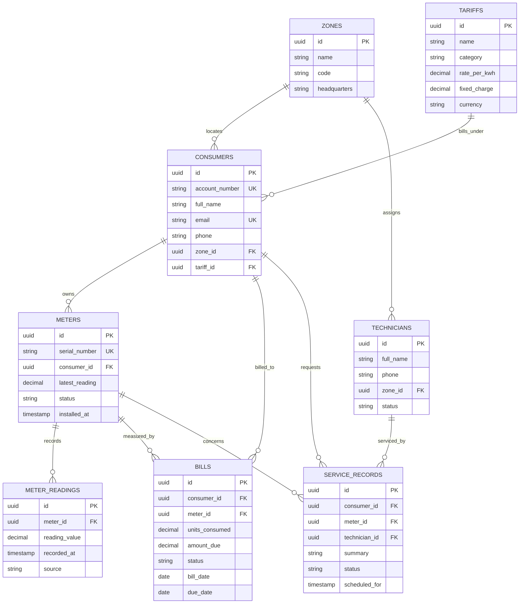

### Table Reference

| Table | Purpose | Primary Keys & Relationships |
|---|---|---|
| **`zones`** | Grid distribution zones & territories | `id` (PK) |
| **`tariffs`** | Rate structures & fixed charges | `id` (PK) |
| **`consumers`** | Utility account holders | `id` (PK), `zone_id` (FK), `tariff_id` (FK) |
| **`meters`** | Installed smart meter hardware | `id` (PK), `consumer_id` (FK) |
| **`meter_readings`** | Time-series meter telemetry | `id` (PK), `meter_id` (FK) |
| **`bills`** | Invoices & payment tracking | `id` (PK), `consumer_id` (FK), `meter_id` (FK) |
| **`technicians`** | Field crew workforce | `id` (PK), `zone_id` (FK) |
| **`service_records`** | Maintenance tickets & dispatch | `id` (PK), `consumer_id` (FK), `meter_id` (FK), `technician_id` (FK) |

---

## 🔒 Security & Access Control (PostgreSQL RLS)

GridFlow demonstrates modern database security through **PostgreSQL Row Level Security (RLS)**:
* **Admin Role Isolation**: Restricts schema modification, full table drops, and diagnostic SQL execution to authenticated administrator sessions (`app_metadata.role = 'gridflow_admin'`).
* **Consumer Isolation**: Consumers are restricted to querying their own linked meters, historical readings, and generated bills based on their verified account identifier.
* **Public Access**: Public landing page only accesses aggregate metrics (total connected consumers, cumulative kWh delivered, technician counts) without exposing personally identifiable information (PII).

---

## 🏗 System Architecture

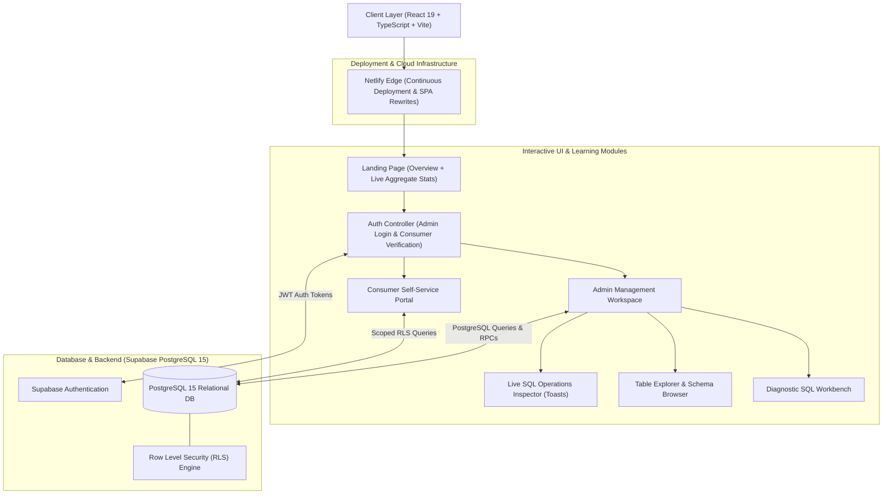

---

## 🛠 Technology Stack

* **Database**: PostgreSQL 15 via [Supabase](https://supabase.com/)
* **Frontend**: [React 19](https://react.dev/)
* **Language**: [TypeScript 5.9](https://www.typescriptlang.org/)
* **Bundler & Tooling**: [Vite 7](https://vitejs.dev/)
* **State & Data Visualization**: [Recharts 2.15](https://recharts.org/)
* **UI Micro-Animations**: [Framer Motion 12](https://www.framer.com/motion/)
* **Icons**: [Lucide React](https://lucide.dev/)
* **Hosting & CI/CD**: [Netlify](https://www.netlify.com/) (configured via `netlify.toml`)

---

## 🚀 Getting Started

### Prerequisites
* **Node.js**: `v20.19.0+` or `v22.12.0+`
* **npm**: `v10+`

### 1. Clone the Repository
```bash
git clone https://github.com/BALAJIx64/GridFlow.git
cd GridFlow
```

### 2. Install Dependencies
```bash
npm install
```

### 3. Configure Database Credentials
Create a `.env.local` file in the root directory:
```env
VITE_SUPABASE_URL=https://your-project-id.supabase.co
VITE_SUPABASE_ANON_KEY=your-supabase-anon-key
```
*(Pre-configured credentials are provided in `.env.example` for testing).*

### 4. Seed the Database
Run the seed migration script in your Supabase SQL editor:
```sql
supabase/migrations/20261004_seed_tamilnadu_data.sql
```
This populates the database with realistic sample utility zones, 25 consumers, meters, historical readings, bills, and field technicians.

### 5. Launch Local Development Server
```bash
npm run dev
```
Open your browser and navigate to `http://localhost:5173/`.

### 6. Build for Production
```bash
npm run build
```

---

## 🔑 Demo Access Credentials

To explore both perspectives of the database:

| Portal | Access Method | Credentials |
|---|---|---|
| **Administrator** | Email & Password | **Email**: `balaji.c.m.x64@gmail.com`<br>**Password**: *(Entered manually during sign-in)* |
| **Consumer Portal** | Passwordless Verification | **Email**: `karthikeyan.ramaswamy@grid`<br>**Account ID**: `GF-TN-1001` |

---

## 📸 Visual Audit Gallery

<details>
<summary><b>📸 Visual Audit Gallery & System Screenshots (click to expand)</b></summary>
<br />

<div align="center">

### 1. Public Landing Page & Live Database Telemetry
*Unobstructed hero view displaying live database metrics pulled from Supabase.*
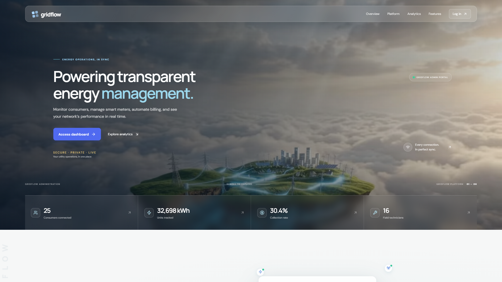

### 2. Administrator Access & Authentication
*Secure portal login requiring verified manual administrator credentials.*
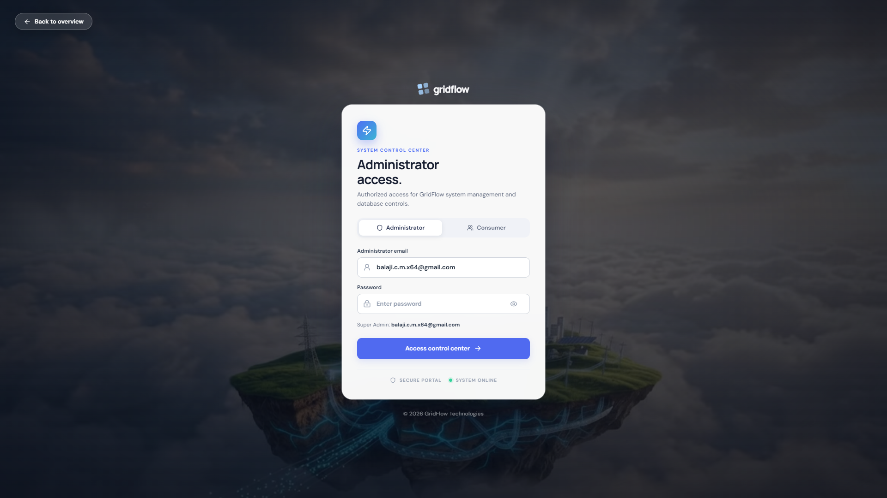

### 3. Database Operations & SQL Console
*Run diagnostic queries, examine execution latency in ms, and observe database responses.*
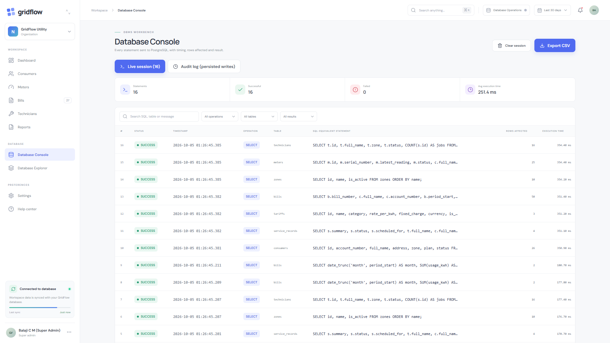

### 4. Table Explorer & Relational Schema Browser
*Inspect columns, foreign keys, and raw rows across all 12 system entities.*
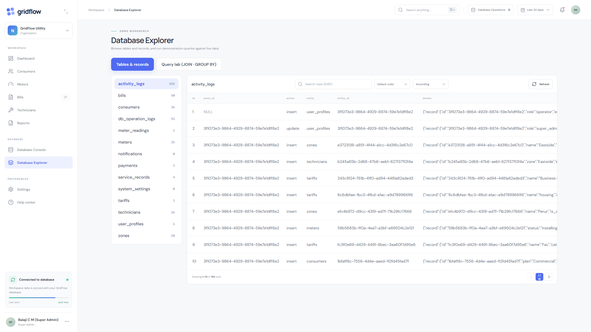

### 5. Executive Dashboard & Real-Time Analytics
*Live aggregations of load curves, revenue recovery, and hardware status.*
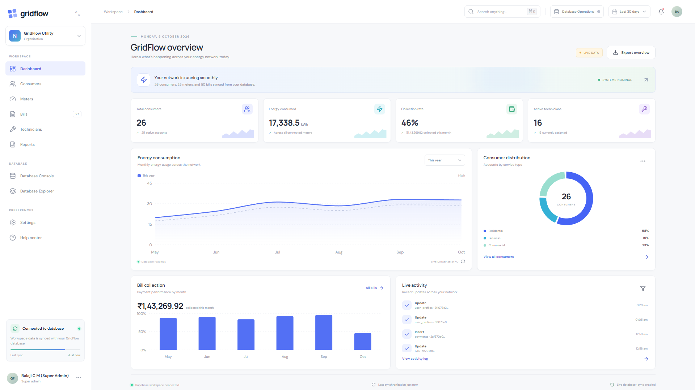

### 6. Consumer Management & Relational Directory
*Managing consumer entities and linking them to tariffs and zones.*
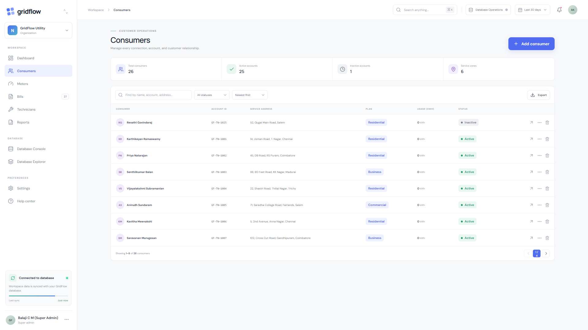

### 7. Smart Meter Telemetry & Telemetry Monitoring
*Tracking physical hardware units, connectivity status, and cumulative consumption readings.*
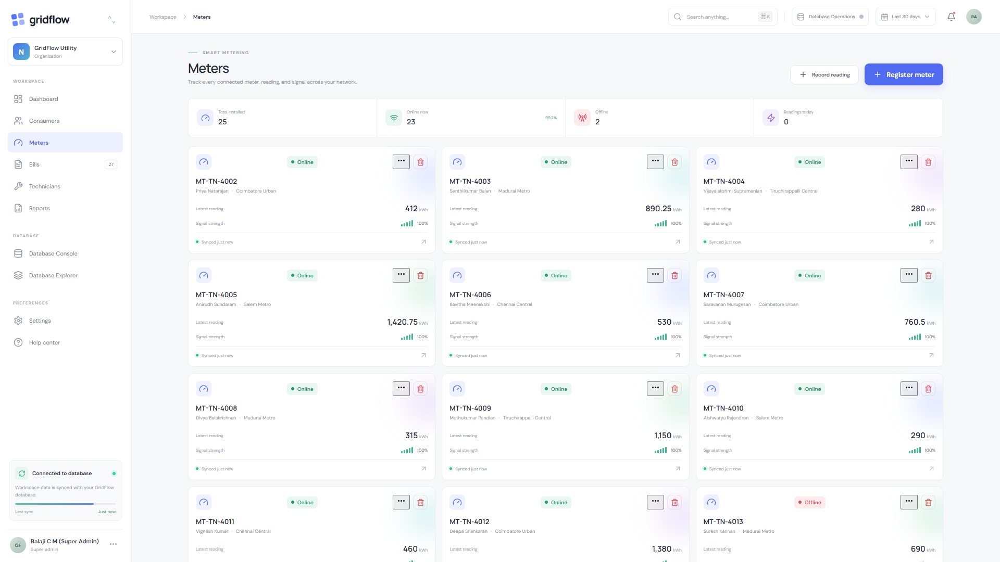

### 8. Billing Engine & Revenue Recovery
*Automated slab-based invoices in INR (`₹`) with payment status tracking.*
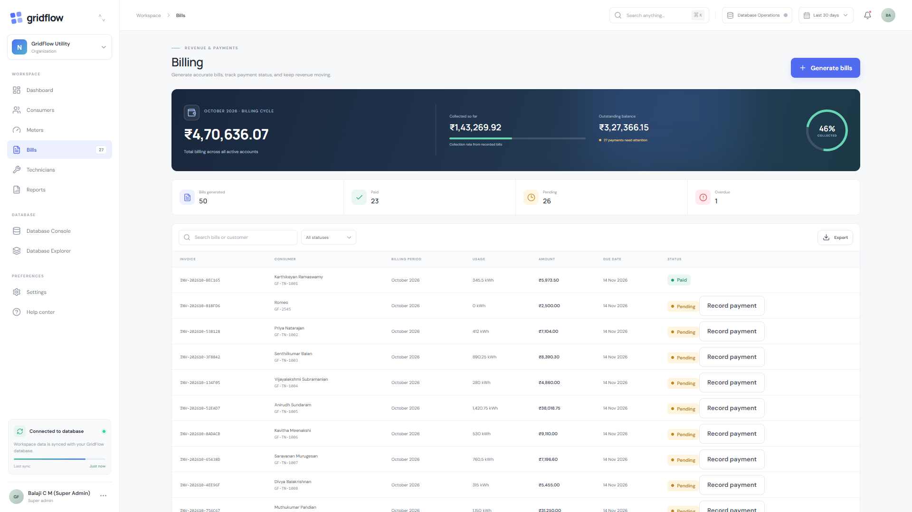

### 9. Field Technician Scheduling & Dispatch
*Assigning service records and tracking technician availability.*
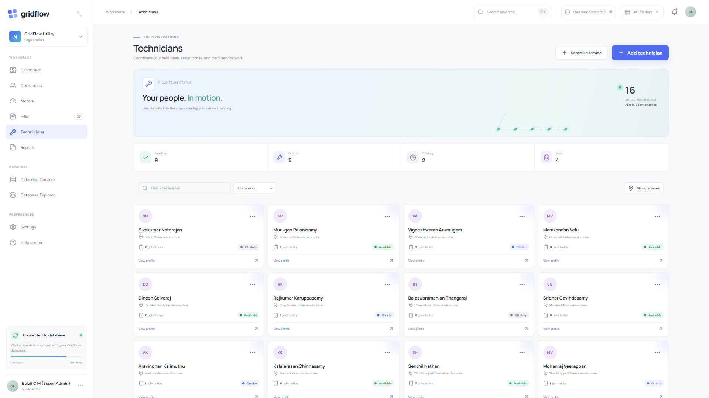

### 10. Consumer Self-Service Portal
*Scoped, consumer-isolated view of meter readings, connection details, and invoice payments.*
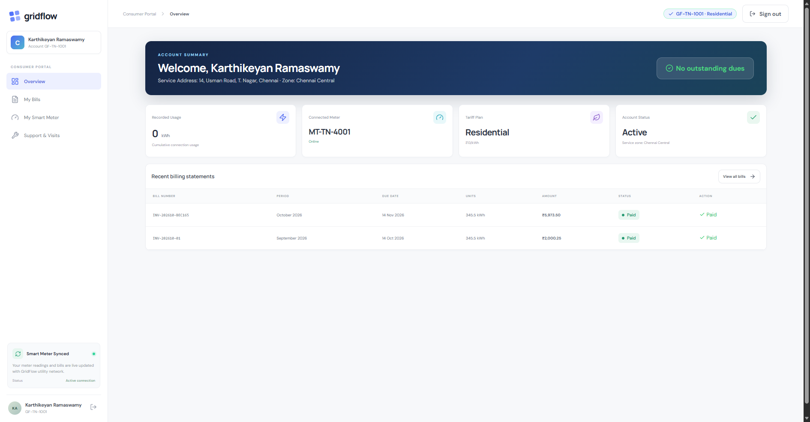

</div>

</details>

---

## 📄 License

This project is open-source under the **MIT License**.

Built for studying, experimenting with, and mastering **Relational Database Management Systems (DBMS)** and modern full-stack application architecture. ⚡️
