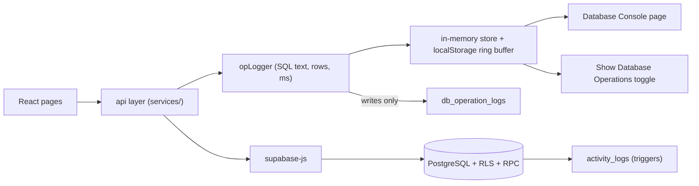

# GridFlow – Implementation Plan

**Guardrail:** No existing component, class name, CSS rule, animation, chart or layout is edited visually. New screens reuse existing classes (`panel`, `table-panel`, `DataTable`, `SectionHeading`, `Pill`, `button-*`, `entity-summary-strip`). The only new CSS goes in a separate appended block, used by the new pages only. Refactors to existing files move code without changing the rendered markup.

## Architecture



Every `api.*` call goes through a single `run(op)` wrapper. It builds the SQL-style preview, times the call, records rows affected and success/failure, and pushes the entry to the logger. That wrapper is the one place that satisfies requirements 5, 6 and 8 for all operations, including SELECT and COUNT.

## Phase 1 – Database (new `supabase/migrations/`, schema.sql kept as the fresh-install file)
1. **`user_profiles`** (`id → auth.users`, `email`, `full_name`, `role` in `super_admin|admin|operator`, `is_active`).
2. `current_role()` and `has_role(...)` helpers. These read `user_profiles` (not a user-editable claim). The first signed-up user can bootstrap as `super_admin` through `bootstrap_super_admin()`, which works only while the table is empty.
3. **Role-aware RLS** replaces the four identical policies:
   - `operator`: select everywhere, insert/update on readings, service records and bills' payment recording. No deletes.
   - `admin`: full CRUD except `user_profiles` and `system_settings`.
   - `super_admin`: everything, including managing users.
4. **`db_operation_logs`** (`id`, `actor_id`, `op_type`, `table_name`, `sql_text`, `rows_affected`, `success`, `error`, `duration_ms`, `created_at`). Inserts are allowed for authenticated users and only super_admin/admin can read.
5. Fixes: `mark_overdue_bills()` RPC (called on load) (G5); zone FKs enforced and `zone_id` populated (G6); first-period fallback in `generate_bills` (G18); `consumers.zone` kept as a denormalized label via trigger.
6. **Reporting RPCs** (all `security invoker`): `report_consumption_by_zone`, `report_revenue_by_tariff` (GROUP BY and JOIN), `report_top_consumers`, `report_table_counts` (COUNT per table), and a `report_dashboard(p_from,p_to)` that returns the already-used analytics shape plus `collected_this_month`, `readings_today` and `online_ratio`.
7. **`db_explorer_tables()` and `db_explorer_rows(table, limit, offset, order, filter)`**. They use an allow-list of table names and `format('%I')` so no SQL can be injected.
8. Realtime publication extended to the new tables.

## Phase 2 – Service layer (split `services.ts`, no UI impact)
```
src/lib/supabase.ts        client + config
src/lib/opLogger.ts        run(), SQL builders, subscribe(), clear(), export CSV
src/services/{consumers,meters,bills,payments,technicians,tariffs,zones,reports,explorer,users}.ts
src/context/AuthContext.tsx  session, profile, role, `can(action)`
src/components/RequireRole.tsx
```
- The `api` object keeps the same method names, so `App.tsx` call sites don't change.
- Fix G2 by passing `consumerId`.
- Add zone, payment and user services.
- Add server-side search/sort/filter/pagination via `.ilike/.order/.range` plus a `count: 'exact'` head request, so the COUNT shows in the console.
- Friendly mapping of Postgres error codes (23503 FK, 23505 unique, 42501 RLS) (G4).

## Phase 3 – Auth and role gating
- Keep the current sign-in screen exactly as is. Replace the `gridflow_admin` check with a `user_profiles` lookup.
- Role-based visibility: hide or disable existing buttons (never restyle) based on `can()`. A disabled button uses the existing `:disabled` style.
- Add history-based route guard (`#/consumers` etc.) so refresh keeps the page and unauthorized routes redirect.
- Add the "first-run: create super admin" path inside the login screen only when `bootstrap_super_admin` is available (uses existing form).

## Phase 4 – New pages (nav entries added using existing `side-link` items)
| Page | Contents |
|---|---|
| **Database Console** | Table of ops: Timestamp · Operation (SELECT/INSERT/UPDATE/DELETE/COUNT/RPC) · Table · SQL Preview (monospace) · Status · Rows. Filter by op/table/status, search, clear, export CSV. Reads `db_operation_logs` (persisted) merged with the live session buffer. |
| **Database Explorer** | Left: table list with row counts. Right: paginated, sortable, searchable record grid, column types, and a read-only row detail drawer. Built on `DataTable`. |
| **Zones** (under Settings tab) | Full CRUD, feeds all zone dropdowns. |
| **Payments** (section in Bills page area) | List with join to bill and consumer. |
| **Users and Roles** (Settings tab, super_admin) | Create, change role, deactivate. |

## Phase 5 – "Show Database Operations" (SQL demonstration mode)
- A toggle in the topbar actions group, persisted in localStorage.
- When on, each action pops a toast-style SQL card. It reuses the existing `toast-stack` and `Toasts` look with a monospace line, e.g. `INSERT INTO consumers (account_number, full_name, …) VALUES (…) → 1 row · 42 ms`.
- Dashboard and list loads show `SELECT … JOIN …` and `COUNT(*)` entries too.

## Phase 6 – Dashboard and reporting on real data
- Replace the hard-coded strings in G9–G12 with real values or neutral empty text.
- Make the date-range and report filters pass `p_from/p_to` to the RPCs (G10).
- Fix "collected this month" and "active consumers" (G11).
- Reports page: add the group-by and join tables under the existing layout.
- Notifications popover reads the `notifications` table.

## Phase 7 – Quality
- Validation helpers (zod-free, small): account number format, positive readings, reading ≥ previous reading, dates.
- Loading states using existing `busy` and `disabled` patterns, plus `ErrorBoundary`.
- Split `App.tsx` into `pages/` and `components/` files, with a byte-for-byte equivalent JSX tree (checked by DOM snapshots).
- Replace `+1 (555)` placeholders with an INR/India pattern.
- Restore placeholders in `.env.example`.
- `npm run build`, `tsc` and a browser walkthrough with screenshots to confirm no visual diff.

## Verification
1. Apply the SQL migration in the Supabase SQL editor (CLI is not installed here). I will also provide a rollback script.
2. Walkthrough per role: bootstrap super_admin → add zone, tariff, consumer, meter, reading → generate bills → record payment → check Console and Explorer.
3. Before/after screenshots of every existing page.
4. Check RLS: an operator cannot delete, and anon gets zero rows.

## Decisions I need from you
1. **Roles source:** a `user_profiles` table (my recommendation) instead of the Auth `app_metadata` claim. OK?
2. **Persistence of the console:** store writes in `db_operation_logs` (permanent, good for viva) and keep reads session-only? Or persist SELECTs too (noisier)?
3. **Router:** hash routes (`#/bills`) so no new dependency is added. OK?
4. **Deleting consumers with bills:** block with a clear message (recommended), or cascade/void?
5. **Where the SQL demo toggle sits:** topbar next to the date-range button, or inside the Database Console page header?
